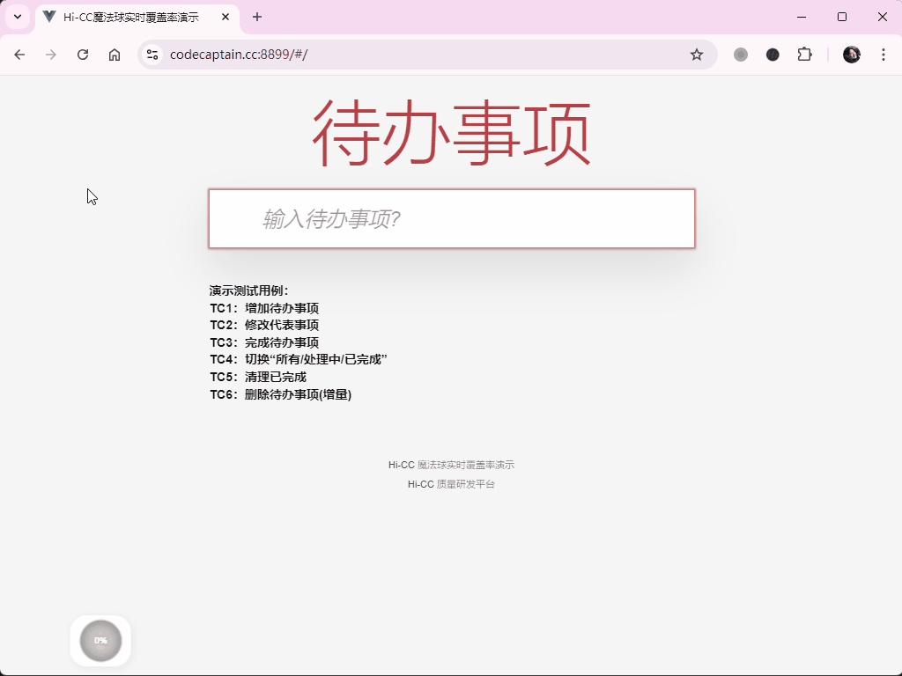
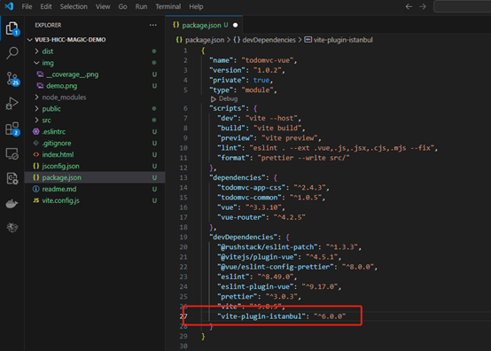

# Hi-CC魔法球：Vue3+Vite示例项目
- [Hi-CC魔法球](https://gitee.com/thm1118/hi-cc-magic)是 上海惠艾信息科技有限公司的前端测试覆盖率度量展示工具，通过浏览器插件方式，帮助测试人员/开发人员在测试过程中，能实时获知被测页面的代码覆盖率情况，同时反馈未被测试的代码的行号以便及时补测，是研发测试的**防漏测神器**。
- [Hi-CC魔法球](https://gitee.com/thm1118/hi-cc-magic)提供测试历史覆盖率记录，可累计当天最高覆盖率，累计近期最高覆盖率。
- [Hi-CC魔法球](https://gitee.com/thm1118/hi-cc-magic) 可通过浏览器插件部署，也支持混合移动App（企业版），更详细说明参阅 [Hi-CC魔法球](https://gitee.com/thm1118/hi-cc-magic) 的 [安装说明](https://gitee.com/thm1118/hi-cc-magic#%E5%BF%AB%E9%80%9F%E5%85%A5%E9%97%A8%E5%A6%82%E4%BD%95%E4%B8%8B%E8%BD%BD)

|  | 
|:--:| 
| *基本功能演示: 点击图片可全屏* |

- [Hi-CC魔法球](https://gitee.com/thm1118/hi-cc-magic) 支持现代前端的三大主流框架 Vue/Anguarl/React

## 实现原理
- 前端代码在部署前需要 使用istanbul工具对代码"插桩"
- “插桩”后的代码在浏览器运行时会输出覆盖率数据，在浏览器中打开控制台F12，键入 `window.__coverage__`可看到覆盖率数据。
- Hi-CC魔法球基于此数据计算并呈现。
- 在览器扩展安装后，如果 检测到`window.__coverage__`是有效存在的，则会应显示浏览器扩展的魔法球，未检测到，不会显示魔法球。

## 如何“插桩"
- 本仓库演示基于Vue3框架的istanbul覆盖率插桩
  - 如需查看vue2.6 的istanbul覆盖率插桩 ，请访问[vue2.6示例](https://gitee.com/thm1118/vue2.6-hicc-magic-demo)
  - 如需查看vue2.5 的istanbul覆盖率插桩 ，请访问[vue2.5示例](https://gitee.com/thm1118/vue2-hicc-magic-demo)
  - 如需查看angular6+ 的istanbul覆盖率插桩，请访问[angular6+ 示例](https://gitee.com/thm1118/angular17-hicc-magic-demo)
  - 如需查看react 的istanbul覆盖率插桩，请访问[react17 示例](https://gitee.com/thm1118/react17-hicc-magic-demo)
- Vue3项目的构建工具链通常是Vite，Vite有Istanbul工具的插件。
- 在项目根目录下执行 `yarn add -D vite-plugin-istanbul` 安装该插件，成功后在`package.json`内会有该插件
- 在vite的配置文件 `vite.config.js`中配置 `vite-plugin-istanbul`, 添加:
```
...
  plugins: [
    vue(),
    istanbul({
      include: 'src/*',
      exclude: ['node_modules', 'test/'],
      extension: ['.js', '.ts', '.vue'],
      requireEnv: false,
      forceBuildInstrument: true
    }),
  ],
...
```
- 可参考 [vite.config.js](vite.config.js)完整实现

## 项目构建
- 项目构建
  - 执行 `yarn run build` 或`npm run build` 构建
  - 构建输出到 `dist`目录下
- 如果需要快速演示，[dist](/dist/)目录是已构建好的SIT环境配置。可以用node工具`serve`或其他本地http服务工具快速启动演示,
    - `serve`命令安装 ：`yarn global add serve`
    - 在dist目录下，启动一个命令行窗口，运行 `serve`,即可开启http服务 `http://localhost:3000/`


